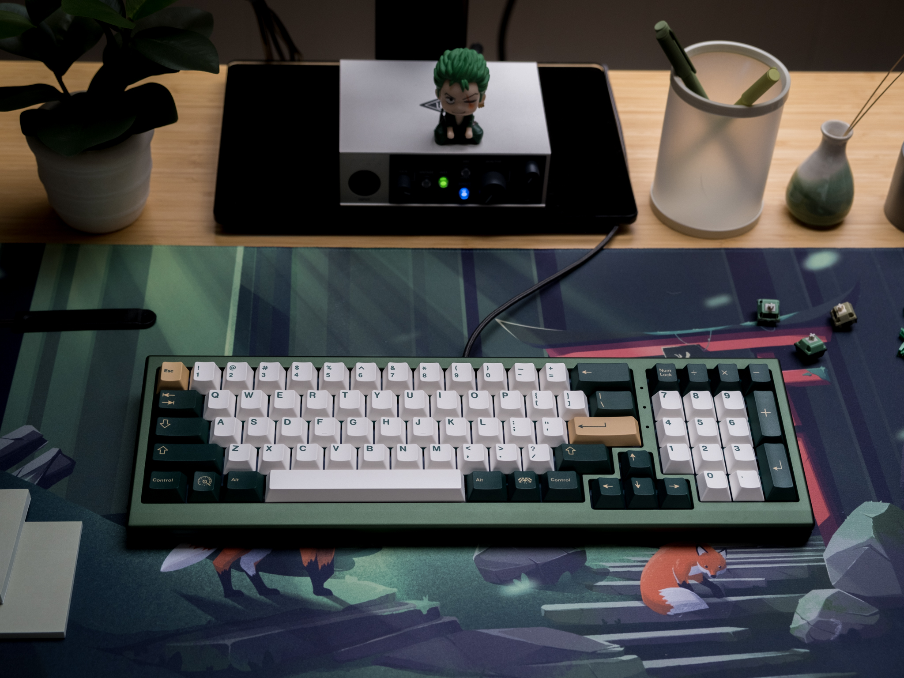

> [!CAUTION]
> These files are ${\textsf{\color{red}NOT COMPATIBLE}}$ with the [prototype boards from V0.1 & V0.2.](https://github.com/akb-file-repo/petrichor-prototypes) 

# AKB Petrichor (Group Buy)

The smell of dust after rain(e).

* [Website](https://alchemistkeyboards.com/projects/keyboards/petrichor/)

## Specifications

* 8° typing angle 
* 6063 aluminium top/bottom case 
* 20mm effective front height (with bumpons) 
* ~1.7kg (3.75lbs) built weight
* Standard & HHKB-ish layouts 
* Gasket mounted 
* QMK and VIA-compatible PCBs (solder & hotswap), designed by Upas
* RGB LED indicator daughterboard 
* USB 2.0 passthrough hub, designed by Cipulot
* OG-style product sticker on bottom a la OGR 
* Internal brass weight to cover the hub parts 
* Bold, pronounced seam
